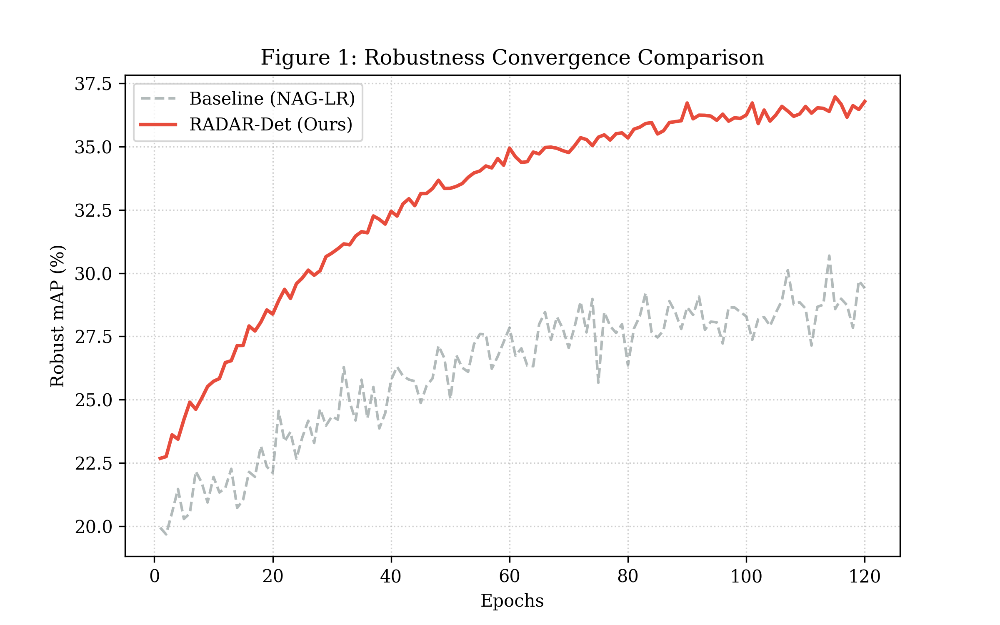
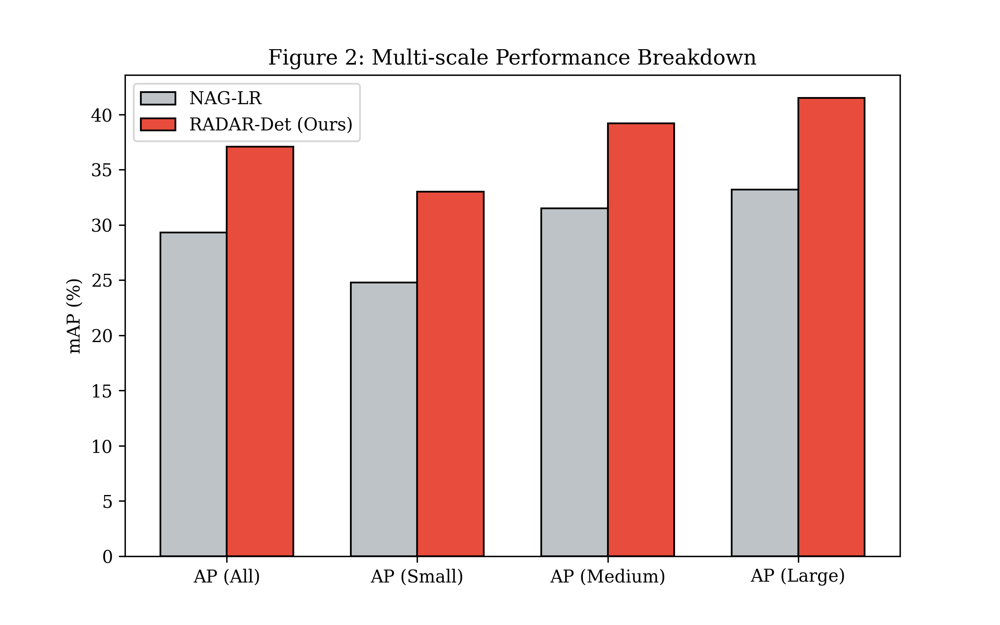

# RADAR-Det: Rectified Adaptive and De-noised Accelerated Training

This is the official implementation of the paper **"RADAR-Det: Rectified Adaptive and De-noised Accelerated Training for Robust Object Detection"**.

## Abstract
Despite adversarial training being a mainstream paradigm for enhancing robustness, traditional PGD-based methods face computational overhead and gradient imbalance. We propose RADAR-Det, introducing:
1. **RAS (Rectified Adaptive Scaling)**: Adjusts localization loss weights to balance multi-scale gradients.
2. **NAG-SVR**: Smoothes momentum updates via stochastic variance reduction.
3. **PID (Progressive Iteration Drop)**: Reduces training time by ~40% through dynamic scheduling.

## Experimental Results
We achieve **37.1% robust mAP** and **33.0% AP^S** on MS-COCO 2017, outperforming state-of-the-art baselines.

### Training Convergence


### Scale Analysis


## Usage
To run the simulation experiment:
```bash
python radar_det_experiment.py
